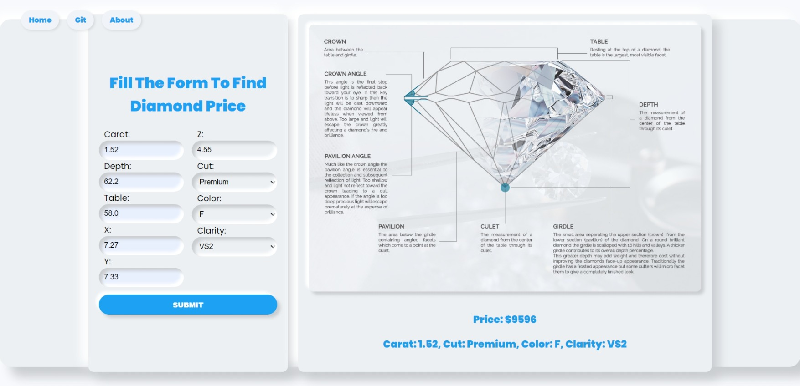

# Diamond Price Prediction

This repository contains an **open-source application** for predicting the price of diamonds using **Machine Learning (ML)**. The project is designed for both practical applications and as a learning resource for data science and machine learning enthusiasts.

---




## 🌟 Features

- **Accurate Predictions**: Get price estimates based on diamond characteristics like carat, cut, color, and clarity.
- **User-Friendly Interface**: Simple and intuitive web application for inputting attributes and viewing results.
- **Open-Source**: Fully customizable and available for contributions.

---

## 🚀 Getting Started

### 1. Clone the Repository

```bash
git clone https://github.com/your-username/diamond-price-prediction.git
cd diamond-price-prediction
```

### 2. Install Dependencies

Ensure you have Python installed on your system. Then, install the required Python libraries:

```bash
pip install -r requirements.txt
```

### 3. Run the Application

Start the Flask server by running:

```bash
python application.py
```

The application will be available at `http://127.0.0.1:5000/`or localhost:5000 in your browser.

---

## 🔧 How It Works

1. **Input Features**:
   - Users provide details like `carat`, `cut`, `color`, and `clarity` through a web form.

2. **Machine Learning Model**:
   - The input is processed using a trained regression model to predict the price.

3. **Results Display**:
   - The estimated price and input details are displayed dynamically.

---

## 💂️ Project Structure

```plaintext
├── setup.py
├── notebooks
├── application.py        # Flask application
├── static/               # CSS, JavaScript, and images
├── templates/            # HTML templates
├── src/                  # Trained machine learning model
├── requirements.txt      # Python dependencies
└── README.md             # Project documentation
```

---

## 🧠 Machine Learning Details

The ML model was trained on a dataset containing detailed information about diamonds. Key techniques include:

- **Feature Engineering**: Processed features like carat, cut, and color.
- **Model Training**: Regression model trained using Scikit-learn.
- **Evaluation**: Achieved high accuracy on the test dataset.

---

## 🤝 Contributions

Contributions are welcome! Here's how you can contribute:

1. Fork the repository.
2. Create a new branch.
3. Make your changes.
4. Submit a pull request.

---

## 📘 License

This project is licensed under the **MIT License**. See the [LICENSE](LICENSE) file for more details.

---

<!-- ## 🔗 Links

- **Live Demo**: [Add link here if hosted]
- **GitHub Repository**: [GitHub Link](https://github.com/your-username/diamond-price-prediction) -->

---

## ✨ Acknowledgments

Special thanks to the open-source community for making tools like Python, Flask, and Scikit-learn available, and to everyone who contributes to this project!

---
